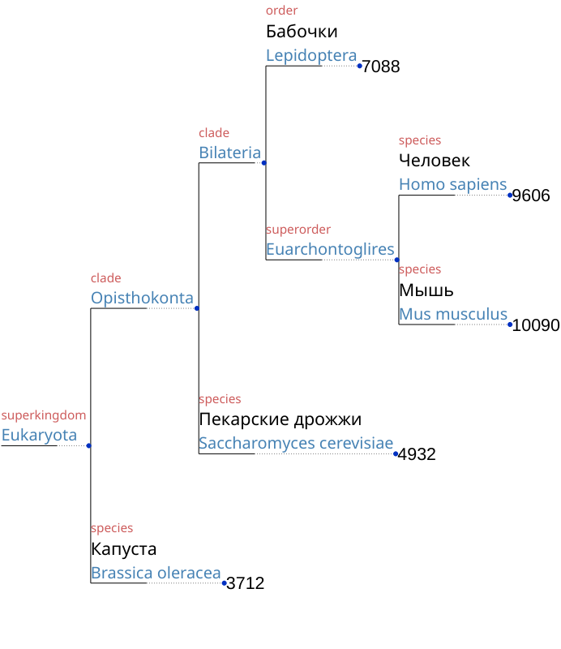
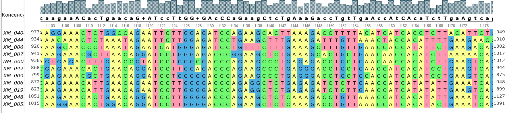
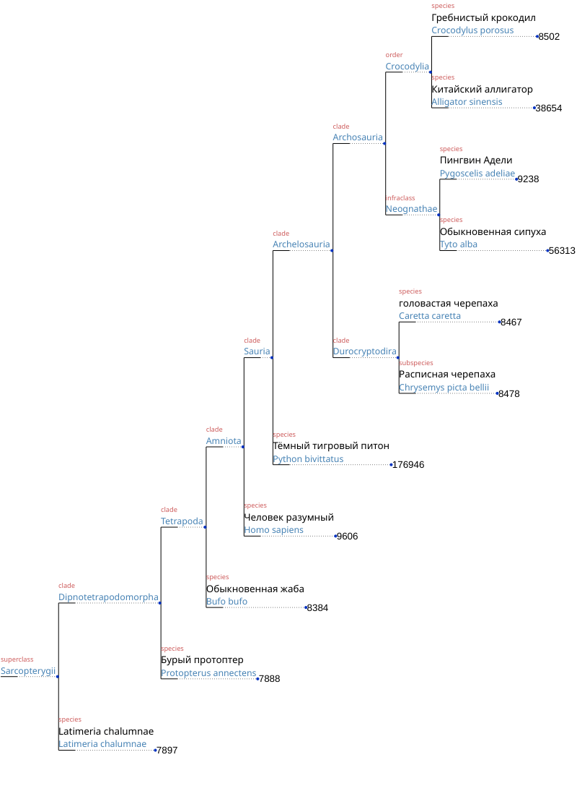

# 1. Таксоны, объединяющие человека, мышь, бобочек, дрожжи и капусту
Генерится скиптом ```build_tree.py```


# 2
Самым ближайшим организмом к человеку является дизентерийная амёба, а 
самым удаленным ламинария сахаристая.

# 3
Название гена - TGFBI transforming growth factor beta induced

Ортологи были найдены через [ncbi ortholog](https://www.ncbi.nlm.nih.gov/gene/7045/ortholog/?scope=9606)

Список генов:
| Gene Symbol | Scientific Name | Russian Name |
| --- | --- | --- |
| TGFBI | Homo sapiens | Человек разумный |
| TGFBI | Caretta caretta | головастая черепаха |
| TGFBI | Tyto alba | Обыкновенная сипуха |
| TGFBI | Python bivittatus | Тёмный тигровый питон |
| TGFBI | Pygoscelis adeliae |  Пингвин Адели |
| TGFBI | Protopterus annectens | Бурый протоптер |
| TGFBI | Chrysemys picta bellii | Расписная черепаха |
| TGFBI | Bufo bufo | Обыкновенная жаба |
| TGFBI | Alligator sinensis | Китайский аллигатор |
| TGFBI | Crocodylus porosus | Гребнистый крокодил |
| TGFBI | Latimeria chalumnae | Лопастопйрые рыбы, русского названия не нашёл |


Выравнивание было построено с помощью ```Clustal Omega``` из файлов ```fasta/human_short.fasta``` и ```fasta/other.fasta```, результат в файле ```result_alignment.clustal_num```

Для анализа результата был использован UGENE, в выравнивании есть один большой участок, на котором последовательности почти совпадают для двух выбранных видов, но длинных участков полного совпадения для всех аидов нет.


Ближайший таксон, объединяющий все рассмотренные виды - Sarcopterygii, суперкласс, объединяющий четвероногих и лопастопёрых рыб

