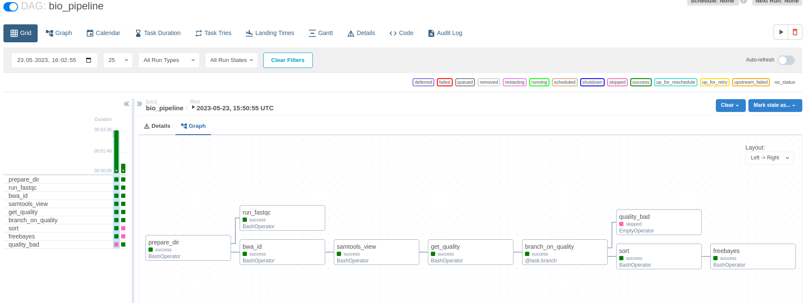
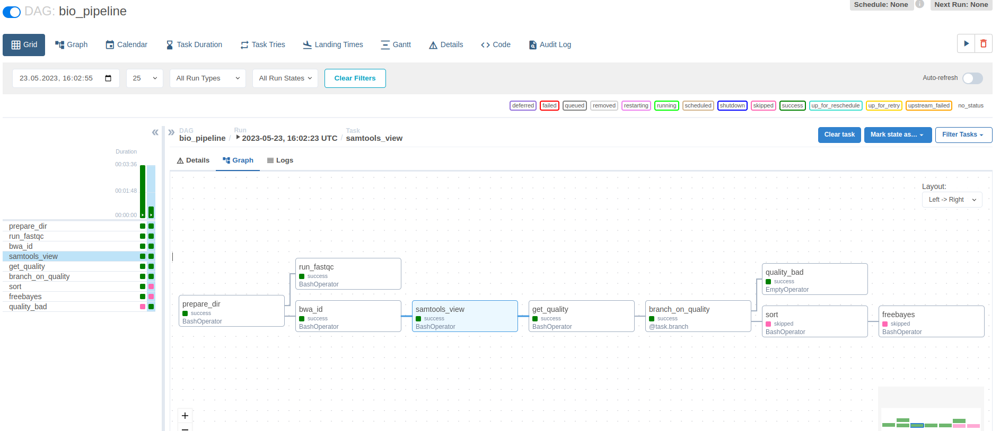

# Homework 3

## 1. Прочтения, взятые для анализа
[Хорошее](https://trace.ncbi.nlm.nih.gov/Traces/?view=run_browser&acc=SRR24457391&display=download)   
[Плохое](https://trace.ncbi.nlm.nih.gov/Traces/?view=run_browser&acc=SRR24482006&display=download)   

## 2. Пайплайн на bash
Находится в файле `process.sh`


## 3. Результат работы `samtools flagstat`
* Для хорошего прочтения:
```
6992074 + 0 in total (QC-passed reads + QC-failed reads)
3715846 + 0 primary
0 + 0 secondary
3276228 + 0 supplementary
0 + 0 duplicates
0 + 0 primary duplicates
6491580 + 0 mapped (92.84% : N/A)
3215352 + 0 primary mapped (86.53% : N/A)
0 + 0 paired in sequencing
0 + 0 read1
0 + 0 read2
0 + 0 properly paired (N/A : N/A)
0 + 0 with itself and mate mapped
0 + 0 singletons (N/A : N/A)
0 + 0 with mate mapped to a different chr
0 + 0 with mate mapped to a different chr (mapQ>=5)
```
* Для плохого прочтения
```
3052881 + 0 in total (QC-passed reads + QC-failed reads)
1771371 + 0 primary
0 + 0 secondary
1281510 + 0 supplementary
0 + 0 duplicates
0 + 0 primary duplicates
2587382 + 0 mapped (84.75% : N/A)
1305872 + 0 primary mapped (73.72% : N/A)
0 + 0 paired in sequencing
0 + 0 read1
0 + 0 read2
0 + 0 properly paired (N/A : N/A)
0 + 0 with itself and mate mapped
0 + 0 singletons (N/A : N/A)
0 + 0 with mate mapped to a different chr
0 + 0 with mate mapped to a different chr (mapQ>=5)
```
## 4. Скрипт разбора результата `samtools flagstat`
См. скрипт из пункта 2. Код, достающий число из вывода - 
```
samtools flagstat --threads "$NPROC" "$OUT_PATH/result.bam" | python3 -c 'from sys import stdin; d=stdin.read(); import re; print(re.findall(r"\d+\s+\+\s+\d+\s+mapped\s+\((\d+\.\d+)%", d)[0])'
```

## 5. Файлы результатов
[тут](https://disk.yandex.ru/d/olV8LH3o2cnhGg)

## 6. Инструкция по развертыванию и установке фреймворка
Был написан `Dockerfile`. Для запуска выполните скрипт `start_container.sh` (необходим docker). При запуске директория проекта будет смонтирована в контейнере в `/host`, т.е. при запуске пайплайна в настройках к текущей директории можно обращаться как к `/host`. Перед запуском выполните `chmod 777 .`

## 7. Тестовый пайплайн
`dags/hello.py`


## 8. Лог тестового пайплайна
Приведен в файле `hello_world.log`

## 9. Визуалбное создание пайплайна ...
... не использовалось

## 10. Код пайплайна *обработки прочтения*
`dags/pipeline.py`

## 11. Результаты работы пайплайна
* Для *хорошего* чтения:
```
Quality=92.84%
Quality is ok, proceeding
Finished, your results are in result.vcf file
```
* Для *плохого* чтения:
```
Quality=84.75%
Quality is bad, stopping
```

## 12. Лог-файлы работы пайплайна на загруженных данных
См. `good.log` и `bad.log`.
Airflow пишет логи для каждой таски, эти файлы являются конкатенацией логов тасок в порядке выполнения

## 13. Визуализация работы пайплайна


(По ссылке из п.5 есть видео работы)

## 14. Описание использованного способа визуализации и отличия полученной визуализации от блок-схемы алгоритма в свободной форме
Визуализация сделана средствами Airflow.
В данном пайплайне добавлена "параллелизация" исполнения fastqc и всего остального дерева. К сожалению, с БД в виде sqlite это не работает, так как данная БД не поддерживает совместную работу и apache airflow исполняет по одной ноде, но в целом это единственное различие (если я правильно понял вопрос)

## 15. Homo Sapiens
Я запускал на человеке, оно долго думало и выдало ~ 20%.
```
327924930 + 0 in total (QC-passed reads + QC-failed reads)
293956766 + 0 primary
0 + 0 secondary
33968164 + 0 supplementary
0 + 0 duplicates
0 + 0 primary duplicates
69762120 + 0 mapped (21.27% : N/A)
35793956 + 0 primary mapped (12.18% : N/A)
0 + 0 paired in sequencing
0 + 0 read1
0 + 0 read2
0 + 0 properly paired (N/A : N/A)
0 + 0 with itself and mate mapped
0 + 0 singletons (N/A : N/A)
0 + 0 with mate mapped to a different chr
0 + 0 with mate mapped to a different chr (mapQ>=5)
```
(ERR4552133)