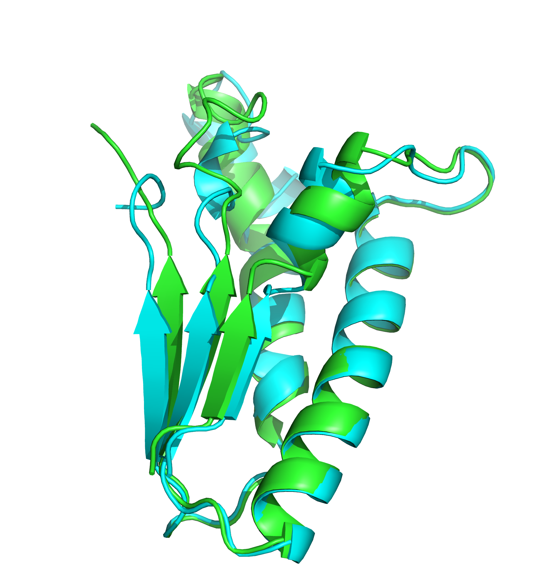

# Домашнее задание 5
Выполнил Мерзляков Илья, группа 20213

## Последовательность
```MKGMLTGPVTILNWSWPREDITHEEQTKQLALAIRDEVLDLEAAGIKIIQIDEAALREKLPLRKSDWHAKYLDWAIPAFRLVHSAVKPTTQIHTHMCYSE```

## Программы
- Предсказатель 1: OpenFold  
- Предсказатель 2: OmegaFold  
- Выравниватель: LovoAlign (Запускал локально, так как протупил и не нашел веб версию)  

## Ноутбуки
- [openfold](OpenFold_ipynb_.ipynb)
- [omegafold](omegafold_ipynb_.ipynb)

## Выводы
- [Предсказание openfold](openfold.pdb)
- [Предсказание omegafold](omegafold.pdb)
- [Предсказание oenfold, выравненное к omegafold](openfold_aligned_to_omegafold.pdb)
- [Лог lovoalign](lovoalign.log)
- [Сессия PyMol2](pymol_session.pse)

## Картиночки



## Выводы
Предсказания двух инструментов достаточно похожи, но openfold работал полчаса, а omegafold справился за несколько секунд.