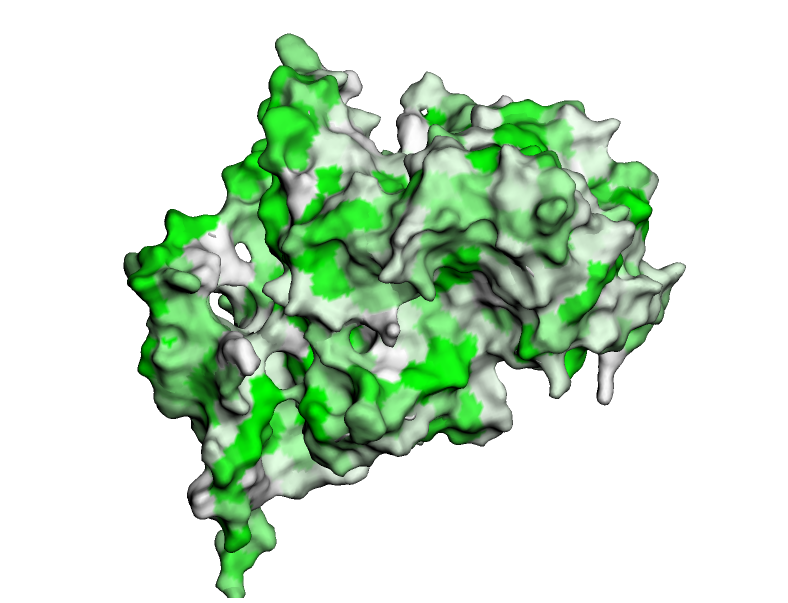
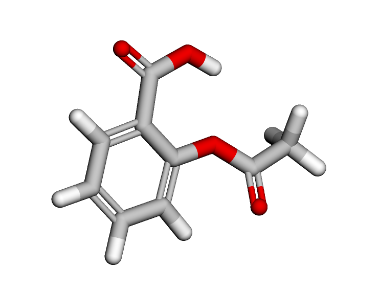
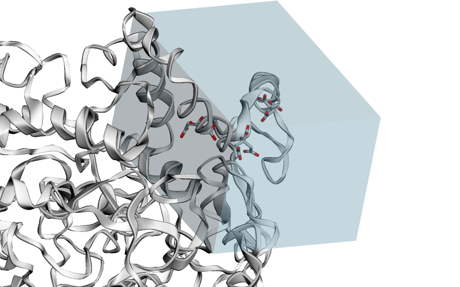
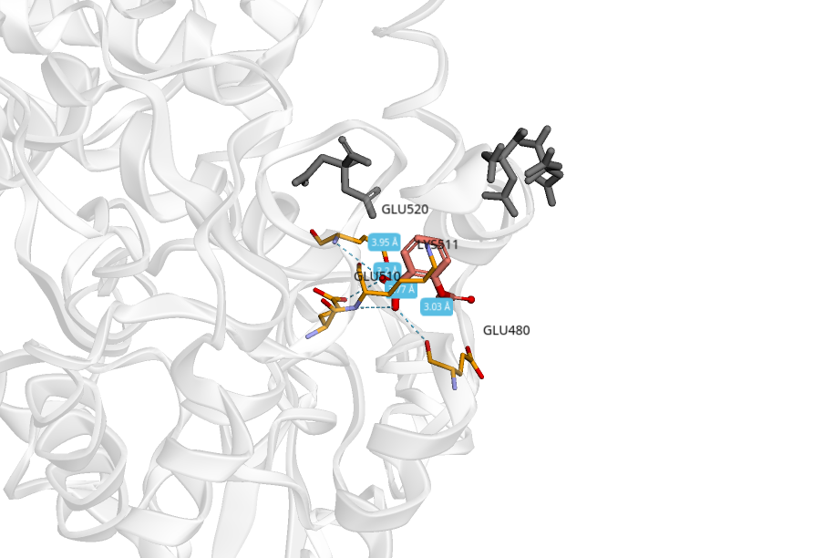

# Домашнее задание 6
Выполнил Мерзляков Илья, группа 20213

## Препарат
- название: Аспирин
- действующее вещество: Ацетилсалициловая кислота
- Smiles: `CC(=O)OC1=CC=CC=C1C(O)=O`
- область применения: Обезболивающее, жаропонижающее средство
- механизм действия: Ацетилсалициловая кислота является необратимым ингибитором циклооксигеназы (PTGS) — фермента, участвующего в синтезе простагландинов и тромбоксанов.

## Таргет
- id: 6Y3C
- Название: Cyclooxygenase-1

## Результаты
- [Ноутбук](basic_molecular_docking.ipynb)
- [PDB](__IDK___1_cmpx.pdb)

## Картинки
### Таргет

### Лиганд

### Бокс

### Докинг

